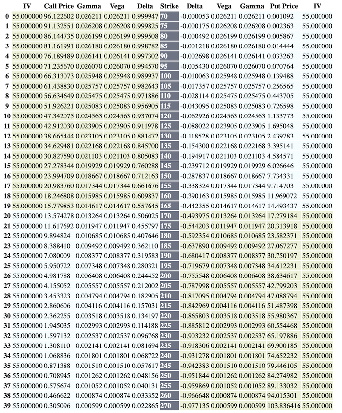
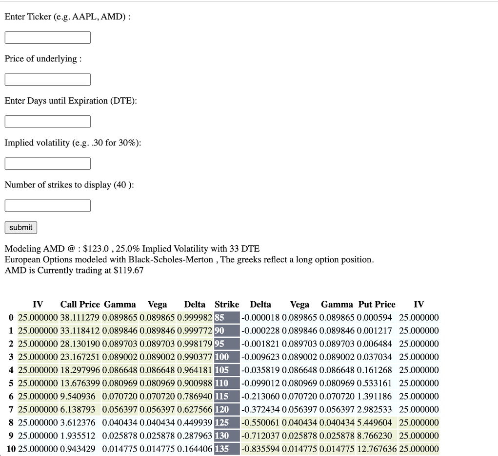

# Theoretical Option Pricer

Produces a chain of theoretical prices of european options and the corressponding greeks for calls and puts given the underlying equities ticker, price , days until expiration, and volatility.

Similar to an option chain you would see in a brokerage, you can select the number of strikes you would like to see. Yellow indicators the option is in the money (ITM) and blue corressponds to out of the money (OTM).

Actual market data is used in two small places:
* The current market price of the underlying is displayed if it is within trading hours, else the last close price is shown as a reference when inputting a value for the spot price.
* An option chain from yfinance is referenced to see the increment between the strike prices.  This can vary between stocks(e.g 2.5 - 5).

## Demo




## Installation

Using the Pip package manager:
```bash
pip install yfinance
pip install -U Flask
```

## Usage of Flask app

Setting an environment variable for the flask project:
```bash
cd the-option-chain
export FLASK_APP=opt_chain.python
flask run
```

## Using the basic script 


## Roadmap
* Refactor Code, Make Chain class for handling logic
* Incorperate other models (binomial, montecarlo)
* Display % change intraday or prior Open/Close
* Display Historic Volatility from market data
* Improved frontend styling
* Fix out of bound lengths for number of strikes (going negative)
* Check generated step increment against actual market chain increments
* Additional checking and handling of input to the calculator form
* Graphing of pay-off diagrams
* Show risk and p/l of combo posiitons

## Resources 

Great information here about implementing options related calculations in python : [Codearmo](https://www.codearmo.com)

Some links on the math using Black-Scholes-Merton : [Easy](https://www.khanacademy.org/economics-finance-domain/core-finance/derivative-securities/black-scholes/v/introduction-to-the-black-scholes-formula), [Medium](https://en.wikipedia.org/wiki/Black–Scholes_model), [Hard](http://math.uchicago.edu/~may/REU2014/REUPapers/Wang.pdf)


